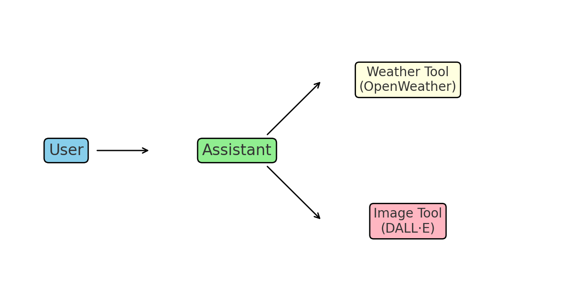

# WeatherVisionAI 🌤️🖼️

WeatherVisionAI is an **agentic AI assistant** that can both **fetch live weather data** and **generate images** of a city with the described weather conditions.  
It uses **OpenWeather API** for real-time weather and **OpenAI’s DALL·E** for images.

---

## 🚀 Features
- 🌍 Get real-time weather for any city (requires `city,country_code`, e.g., `Paris,FR`)
- 🎨 Automatically generate an AI image of the city with current weather
- 🧠 Agentic flow: the assistant decides when to call weather or image tools
- 💾 Saves generated images locally
- 👨‍💻 Extendable: more tools (news, Wikipedia, flights) can be added easily

---

## ⚙️ Setup Instructions

### 1. Clone the repository
```bash
git clone https://github.com/yourusername/WeatherVisionAI.git
cd WeatherVisionAI
```

### 2. Create and activate a virtual environment
```bash
python3 -m venv venv
source venv/bin/activate   # On Linux/Mac
venv\Scripts\activate    # On Windows
```

### 3. Install requirements
```bash
pip install -r requirements.txt
```

### 4. Get API keys
- **OpenAI API key**: [Get it here](https://platform.openai.com/)  
- **OpenWeather API key**: [Get it here](https://home.openweathermap.org/api_keys)  

### 5. Create a `.env` file in the project root
```bash
OPENAI_API_KEY=your_openai_key_here
OPENWEATHER_API_KEY=your_openweather_key_here
```

⚠️ **Both keys are required.** Without them, the assistant will not work.

---

## ▶️ Running the Assistant
```bash
python main.py
```

You will see:
```
✅ OpenAI API Key found, begins with: sk-proj-...
✅ OpenWeather API Key found
🤖 UtilityAI Chatbot ready!
👉 I can help with weather and generate images.
```

---

## 💡 Example Prompts

- **Weather only:**
```
You: What's the weather in Toronto,CA?
Bot: The weather in Toronto, CA is currently clear sky with a temperature of 23°C.
```

- **Weather + Image:**
```
You: Show me Paris with sunny weather
Bot: The weather in Paris, FR is currently sunny with a temperature of 20°C.
✅ Image saved as paris_20250921_123456.png
```

Here’s an example output image:


---

## 🧠 Agentic Flow
The assistant works in two steps:

1. **User query** → Assistant decides whether to call `get_weather` or `artist`  
2. **Tool call execution** → Results are appended back into the conversation  
3. **Final response** → Weather info + generated image (if requested)

Here’s a visual flow of the tool calling:



---

## 📦 Project Structure
```
WeatherVisionAI/
│── main.py          # Runs the chatbot
│── tools.py         # Tool definitions (weather + image)
│── config.py        # API key loading and system config
│── chat.py          # Chat helper
│── requirements.txt # Dependencies
│── README.md        # This file
│── .env             # Your API keys (not committed)
│── sample_weather.png  # Example generated weather image
│── workflow.png        # Workflow diagram for tool calling
```

---

## 📜 License
MIT License. Free to use, modify, and extend.
