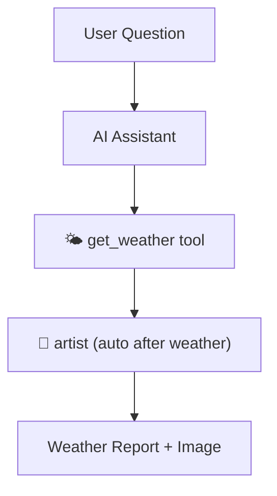
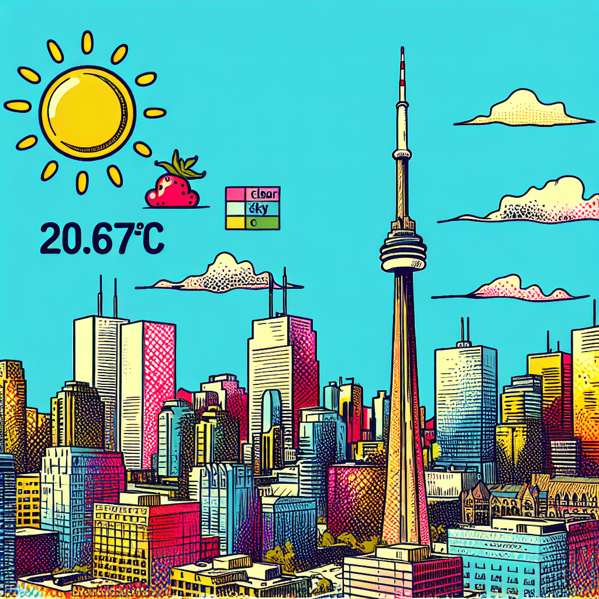

# WeatherVisionAI 🌤️🖼️

[](https://github.com/Walid-Ahmed/WeatherVisionAI/)

WeatherVisionAI is an **agentic AI assistant** that answers weather questions and **automatically generates images** reflecting the weather in that city.  
It combines OpenWeatherMap (for live weather) with OpenAI’s image generation (for visual context).  

👉 Repo: [https://github.com/Walid-Ahmed/WeatherVisionAI/](https://github.com/Walid-Ahmed/WeatherVisionAI/)


Tool Calling (No Agent Framework)

This project uses the OpenAI Python SDK directly for tool calling (function calling).  
No agent framework is used (e.g., LangChain, CrewAI). Tools are provided to the model in the API request, and the model may choose to call them.

```python
response = openai.chat.completions.create(
    model=CHAT_MODEL,
    messages=messages,
    tools=tools,  # expose available tools to the model (framework-free tool calling)
)

---

## 🚀 Features
- Ask about weather in any city (with optional country code).
- Automatically generates a pop-art style image representing the city under current weather conditions.
- Images saved in the `images/` folder and previewed inline.
- Simple and extensible design (agentic workflow: `weather → image`).

---

## ⚙️ Setup

### 1. Clone the repo
```bash
git clone https://github.com/Walid-Ahmed/WeatherVisionAI.git
cd WeatherVisionAI
```

### 2. Install dependencies
```bash
pip install -r requirements.txt
```

### 3. Create `.env` file
Create a file named `.env` in the project root with your API keys:

```env
OPENAI_API_KEY=your_openai_key_here
OPENWEATHER_API_KEY=your_openweathermap_key_here
```

> 🔑 Get free weather API key from: [https://openweathermap.org/api](https://openweathermap.org/api)

---

## ▶️ Usage
Run the assistant:

```bash
python main.py
```

Then type questions like:
- `What's the weather in Toronto,CA?`
- `How is the weather in Paris,FR?`
- `Tell me the weather in Tokyo,JP`

---

## 🧠 Workflow

WeatherVisionAI uses an **agentic flow**:
1. User asks a weather-related question.  
2. Assistant calls `get_weather` tool.  
3. After weather is retrieved, `artist` runs automatically to generate a matching city image.  
4. Response returned with text + saved image.  



---

## 🖼️ Example

**Prompt:**
```
You: How is the weather in Toronto,CA?
```

**Response:**
```
🔧 get_weather called for Toronto,CA  
🎨 artist called for Toronto,CA with weather: Clear sky with 21.12°C  
✅ Image saved as images/sample_toronto.png  
Bot: The weather in Toronto, CA is clear sky with a temperature of 21.12°C.
```

**Generated Image:**



---

## 📂 Project Structure
```
WeatherVisionAI/
│── main.py          # Chat loop, handles agentic workflow
│── tools.py         # Weather tool + artist image generator
│── config.py        # API keys and system configuration
│── requirements.txt # Dependencies
│── images/          # Saved generated images
│── README.md        # Project documentation
```

---

## 🏷️ Repo
👉 GitHub Repo: [https://github.com/Walid-Ahmed/WeatherVisionAI/](https://github.com/Walid-Ahmed/WeatherVisionAI/)

---

## 📜 License
MIT License – free to use, modify, and share.
