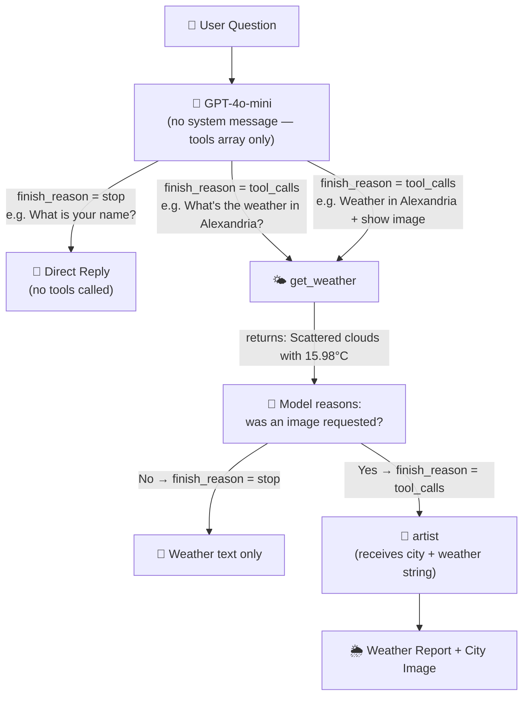
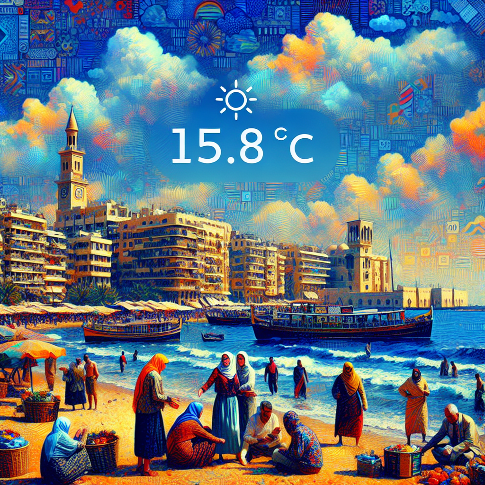

# WeatherVisionAI 🌤️🖼️

[](https://github.com/Walid-Ahmed/WeatherVisionAI/)

WeatherVisionAI is an **agentic AI assistant** that answers weather questions and generates pop-art city images that visually reflect the current weather conditions.
It combines OpenWeatherMap (live weather) with DALL-E 3 (image generation) and GPT-4o-mini (reasoning).

👉 Repo: [https://github.com/Walid-Ahmed/WeatherVisionAI/](https://github.com/Walid-Ahmed/WeatherVisionAI/)

---

## 🤖 Single Agent Design

This is a **single-agent** system — one `gpt-4o-mini` model instance handles the entire conversation: deciding what to do, calling tools, reading results, and producing the final reply. There is no planner model, no sub-agents, and no parallel model instances.

```
One model  →  decides which tools to call  →  executes them sequentially  →  replies
```

A multi-agent design would involve multiple model instances coordinating with each other (e.g. a planner + specialist agents). That complexity is not needed here.

---

## 🧠 How It Works — Agentic Tool Calling

This project uses the **OpenAI Python SDK directly** — no LangChain, no CrewAI, no agent framework.
The model receives a `tools` array and reasons entirely on its own about when to call each tool and in what order. **No system message is used.**

### Two tools exposed to the model

| Tool | Description passed to the model |
|---|---|
| `get_weather` | Get the current real-time weather for a city. |
| `artist` | Generate a pop-art style image of a city reflecting its current weather. Only call this when the user explicitly asks for an image. |

The model reads these descriptions and decides:
- Call `get_weather` when the user asks about weather
- Call `artist` only when the user also asks for an image — passing the weather result from the previous tool call
- Answer directly when no tool is needed

### DALL-E image prompt (in `tools.py`)

When `artist` is called, the weather string from `get_weather` (e.g. `"Scattered clouds with 15.98°C"`) is injected directly into the DALL-E prompt to make sky colour, lighting, and atmosphere reflect real conditions:

```
A vibrant pop-art style image of {city}.
Current weather: {weather}.
The scene must visually reflect these exact conditions:
sky colour, lighting, clothing on people, and atmosphere should all match the weather.
Show recognisable landmarks of {city}.
```

### Agentic loop (in `main.py`)

```python
while True:
    response = openai.chat.completions.create(model=CHAT_MODEL, messages=messages, tools=tools)
    choice = response.choices[0]

    if choice.finish_reason == "tool_calls":
        # Model chose a tool — execute it and feed the result back
        tool_response, _ = handle_tool_call(choice.message)
        messages.append(choice.message)   # assistant's tool-call request
        messages.append(tool_response)    # tool result (role: "tool")
        continue                          # loop: model reasons again with new context

    # finish_reason == "stop" — final text reply, exit loop
    return choice.message.content, messages
```

Each loop iteration handles one tool call. The model calls `get_weather` in turn 1, reads the result, then calls `artist` in turn 2 if an image was requested — the weather value flows through the message history automatically.

---

## 🧭 Workflow


```mermaid
flowchart TD
    User["💬 User Question"] --> AI["🤖 GPT-4o-mini\n(no system message — tools array only)"]

    AI -->|"finish_reason = stop\ne.g. What is your name?"| DirectReply["💬 Direct Reply\n(no tools called)"]
    AI -->|"finish_reason = tool_calls\ne.g. What's the weather in Alexandria?"| W["🌤️ get_weather"]
    AI -->|"finish_reason = tool_calls\ne.g. Weather in Alexandria + show image"| W

    W -->|"returns: Scattered clouds with 15.98°C"| AI2["🤖 Model reasons:\nwas an image requested?"]
    AI2 -->|"No → finish_reason = stop"| TextOnly["💬 Weather text only"]
    AI2 -->|"Yes → finish_reason = tool_calls"| A["🎨 artist\n(receives city + weather string)"]
    A --> WeatherReply["🌦️ Weather Report + City Image"]
```

---

## 💬 Example Prompts

### Weather only — calls `get_weather`, returns text
```
You: What's the weather in Alexandria?
You: Is it hot in Tokyo,JP right now?
You: How cold is it in London,GB?
```

### Weather + image — calls `get_weather`, then `artist`
```
You: What's the weather in Alexandria? Also show me an image.
You: How is the weather in Paris,FR? Generate a city image too.
You: Tell me the weather in Toronto,CA and create a picture of it.
```

### General — no tools called, direct reply
```
You: What is your name?
You: What can you help me with?
You: What tools do you have?
```

---

## 🖼️ Example Output

**Prompt:** `What's the weather in Alexandria? Show me an image too.`

```
🔧 get_weather called for Alexandria
🌍 Weather API status: 200
Bot reasoning: image was requested → calling artist
🎨 artist called for Alexandria with weather: Scattered clouds with 15.98°C
✅ Image saved as images/alexandria_20260504_205548.png
Bot: The weather in Alexandria is scattered clouds with 15.98°C. Here's a city image reflecting those conditions!
```

**Generated Image — Alexandria (Scattered clouds, 15.98°C):**



---

## ⚙️ Setup

### 1. Clone the repo
```bash
git clone https://github.com/Walid-Ahmed/WeatherVisionAI.git
cd WeatherVisionAI
```

### 2. Install dependencies
```bash
pip install -r requirements.txt
```

### 3. Create `.env` file
```env
OPENAI_API_KEY=your_openai_key_here
OPENWEATHER_API_KEY=your_openweathermap_key_here
```

> 🔑 Free weather API key: [https://openweathermap.org/api](https://openweathermap.org/api)

### 4. Run
```bash
python main.py
```

---

## 🔧 Configuration

All configuration lives in `config.py`.

| Setting | Value | Purpose |
|---|---|---|
| `CHAT_MODEL` | `gpt-4o-mini` | Conversation and tool-call reasoning |
| `IMAGE_MODEL` | `dall-e-3` | City image generation |
| `OPENAI_API_KEY` | from `.env` | Authenticates chat + image calls |
| `OPENWEATHER_API_KEY` | from `.env` | Fetches live weather data |

---

## 📂 Project Structure
```
WeatherVisionAI/
│── main.py          # Agentic loop — chat, tool execution, history
│── tools.py         # get_weather + artist functions, schemas, handler
│── config.py        # API keys and model constants
│── requirements.txt # Dependencies
│── images/          # Saved generated images
│── README.md        # Project documentation
```

---

## 🏷️ Repo
👉 GitHub Repo: [https://github.com/Walid-Ahmed/WeatherVisionAI/](https://github.com/Walid-Ahmed/WeatherVisionAI/)

---

## 📜 License
MIT License – free to use, modify, and share.
